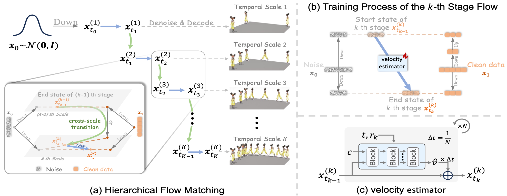

# MotionHiFlow: Texto a Movimiento mediante Acoplamiento de Flujos Jerárquico (CVPR 2026)
### [[Artículo]](https://arxiv.org/pdf/2604.23264)


Si encuentra nuestro código o artículo útiles, considere dar una estrella a nuestro repositorio y citar:
```bibtex
@inproceedings{motionhiflow2026,
  title     = {MotionHiFlow: Text-to-Motion via Hierarchical Flow Matching},
  author    = {Li, Heng and Lin, Xiaotong and Zeng, Ling-An and Kang, Yulei and Li, Shuai and Hu, Jian-Fang},
  booktitle = {Proceedings of the IEEE/CVF Conference on Computer Vision and Pattern Recognition (CVPR)},
  year      = {2026}
}
```

## :postbox: Noticias

📢 **2026-04-29** --- ¡El código y los modelos preentrenados ya están disponibles!

📢 **2026-02-21** --- 🔥🔥🔥 ¡Felicidades! MotionHiFlow ha sido aceptado en CVPR 2026.


## :round_pushpin: Preparación

<details>
<summary><b>Haz clic para expandir</b></summary>

### 1. Entorno Conda
Recomendado: Python `3.10+` con PyTorch habilitado para CUDA.
```bash
conda create -n hiflow python=3.11.14 -y
conda activate hiflow
pip install -r requirements.txt
```
*(Si utiliza una versión diferente de CUDA, actualice `torch` y `torchvision` en `requirements.txt` en consecuencia.)*

### 2. Modelos y Dependencias

#### Preparar Recursos Externos y Modelos Preentrenados
Use `prepare.sh` para preparar los recursos no de código necesarios para el proyecto (evaluadores, GloVe, CLIP y puntos de control preentrenados desde Google Drive/Hugging Face).
```bash
bash prepare.sh all
```
*(Opcional) Para descargar solo partes específicas, puede ejecutar `bash prepare.sh evaluator`, `bash prepare.sh glove`, `bash prepare.sh clip` o `bash prepare.sh pretrained`.)*


#### Solución de Problemas
Si encuentra errores de descarga con `gdown` en `prepare.sh`, intente actualizar gdown: `pip install --upgrade --no-cache-dir gdown`. Si el problema persiste, puede consultar [este problema](https://github.com/wkentaro/gdown/issues/43) para posibles soluciones, o descargar manualmente los archivos desde los enlaces de Google Drive proporcionados en `prepare.sh` y colocarlos en los directorios correspondientes.

### 3. Obtener Datos
Este repositorio espera que los conjuntos de datos se encuentren en la carpeta `datasets/`.
* **HumanML3D**: Siga las instrucciones en [HumanML3D](https://github.com/EricGuo5513/HumanML3D/), luego copie los resultados a nuestro repositorio:
```bash
cp -r <path_to_humanml3d>/HumanML3D/HumanML3D ./datasets/humanml3d
```

* **KIT-ML**: Descárguelo desde [HumanML3D](https://github.com/EricGuo5513/HumanML3D) y colóquelo en `./datasets/kit-ml`


</details>


## :rocket: Demostración
<details>
<summary><b>Haz clic para expandir</b></summary>

Para la generación y renderizado cualitativos, use `gen_t2m.py` directamente.

```bash
bash run.sh gen tmdit gpu_id=0 'text_prompt=A man walks in a circle' motion_length=196
```

Los archivos generados suelen guardarse en:
```text
outputs/<model_name>/
├── animations/
└── joints/
```
</details>


## :book: Evaluación
<details>
<summary><b>Haz clic para expandir</b></summary>

Antes de evaluar, asegúrese de haber:
1. instalado las dependencias,
2. preparado los evaluadores (`bash prepare.sh evaluator`),
3. descargado los puntos de control preentrenados (`bash prepare.sh pretrained`).

### Evaluar HumanML3D
```bash
# Evaluate VAE reconstruction
bash run.sh eval mvae gpu_id=0

# Evaluate Flow/DiT text-to-motion generation
bash run.sh eval tmdit gpu_id=0
```

### Evaluar KIT-ML
```bash
# Evaluate VAE reconstruction
bash run.sh eval mvae-kit gpu_id=0

# Evaluate Flow/DiT text-to-motion generation
bash run.sh eval tmdit-kit gpu_id=0
```

Los resultados de la evaluación se guardan en `logs/<run_name>/eval/` y los registros se escriben en `logs/<run_name>/eval.log`.
</details>


## :space_invader: Entrena Tus Propios Modelos
<details>
<summary><b>Haz clic para expandir</b></summary>

**Nota**: Para obtener la mejor reproducibilidad, entrene el VAE **ANTES** de entrenar el modelo Flow/DiT. Este último utiliza el VAE como su tokenizador latente.

Proporcionamos un lanzador unificado `run.sh`. Internamente, expande los ajustes preestablecidos en anulaciones estilo Hydra (por ejemplo, `model=vae`, `model=tmdit`, `data=kit`, etc.). Las configuraciones principales se encuentran en la carpeta `configs/`.

### 1. Entrenar un VAE desde cero
HumanML3D:
```bash
bash run.sh train mvae gpu_id=0
```
KIT-ML:
```bash
bash run.sh train mvae-kit gpu_id=0
```

### 2. Entrenar un modelo Flow
Antes de ejecutar esto, asegúrese de que `vae_model.name` apunte a un directorio de experimento VAE existente bajo `logs/`.

HumanML3D:
```bash
bash run.sh train tmdit gpu_id=0
```
KIT-ML:
```bash
bash run.sh train tmdit-kit gpu_id=0
```

### Anulaciones personalizadas comunes

* **Cambiar la duración del entrenamiento:** `bash run.sh train tmdit gpu_id=0 max_iter=200000 eval_every=2000`
* **Entrenar en otra GPU:** `bash run.sh train mvae gpu_id=1`
* **Reanudar entrenamiento:** `bash run.sh train tmdit gpu_id=0 is_continue=True`

Todos los modelos preentrenados y los resultados intermedios se guardarán en `logs/<data>_<model>_<id>/`.
</details>

## :pray: Agradecimientos

Agradecemos sinceramente la publicación en código abierto de estos trabajos en los que se basa nuestro código: 
[HumanML3D](https://github.com/EricGuo5513/HumanML3D), [MoMask](https://github.com/EricGuo5513/momask-codes), [MDM](https://github.com/GuyTevet/motion-diffusion-model/tree/main) y [MLD](https://github.com/ChenFengYe/motion-latent-diffusion/tree/main).


## :page_facing_up: Licencia
Este código se distribuye bajo una [LICENCIA MIT](LICENSE).

Tenga en cuenta que nuestro código depende de otras bibliotecas, como CLIP, SMPL, SMPL-X y PyTorch3D, y utiliza conjuntos de datos que cada uno tiene sus propias licencias correspondientes que también deben cumplirse.
