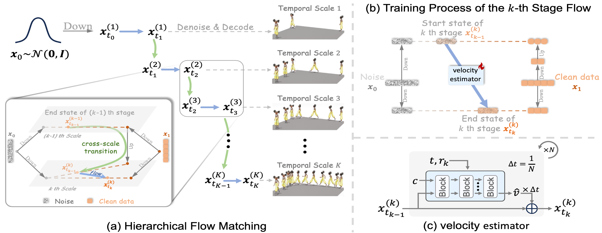

# MotionHiFlow: Text-to-Motion via Hierarchical Flow Matching (CVPR 2026)
### [[Paper]](https://arxiv.org/pdf/2604.23264)


If you find our code or paper helpful, please consider starring our repository and citing:
```bibtex
@inproceedings{motionhiflow2026,
  title     = {MotionHiFlow: Text-to-Motion via Hierarchical Flow Matching},
  author    = {Li, Heng and Lin, Xiaotong and Zeng, Ling-An and Kang, Yulei and Li, Shuai and Hu, Jian-Fang},
  booktitle = {Proceedings of the IEEE/CVF Conference on Computer Vision and Pattern Recognition (CVPR)},
  year      = {2026}
}
```

## :postbox: News

📢 **2026-04-29** --- Code and pretrained models are now released!

📢 **2026-02-21** --- 🔥🔥🔥 Congrats! MotionHiFlow is accepted to CVPR 2026.


## :round_pushpin: Get You Ready

<details>
<summary><b>Click to expand</b></summary>

### 1. Conda Environment
Recommended: Python `3.10+` with CUDA-enabled PyTorch.
```bash
conda create -n hiflow python=3.11.14 -y
conda activate hiflow
pip install -r requirements.txt
```
*(If you use a different CUDA version, update `torch` and `torchvision` in `requirements.txt` accordingly.)*

### 2. Models and Dependencies

#### Prepare External Resources & Pretrained Models
Use `prepare.sh` to prepare the non-code resources needed by the project (evaluators, GloVe, CLIP and pretrained checkpoints from Google Drive/Hugging Face).
```bash
bash prepare.sh all
```
*(Optional) To just download specific parts, you can run `bash prepare.sh evaluator`, `bash prepare.sh glove`, `bash prepare.sh clip`, or `bash prepare.sh pretrained`.*


#### Troubleshooting
If you encounter `gdown` download errors in `prepare.sh`, try upgrading gdown: `pip install --upgrade --no-cache-dir gdown`. If the problem persists, you can refer to [this issue](https://github.com/wkentaro/gdown/issues/43) for potential solutions, or manually download the files from the provided Google Drive links in `prepare.sh` and place them in the expected directories.

### 3. Get Data
This repository expects datasets under the `datasets/` folder.
* **HumanML3D**: Follow the instructions in [HumanML3D](https://github.com/EricGuo5513/HumanML3D/), then copy the results to our repository:
```bash
cp -r <path_to_humanml3d>/HumanML3D/HumanML3D ./datasets/humanml3d
```

* **KIT-ML**: Download from [HumanML3D](https://github.com/EricGuo5513/HumanML3D), then place it in `./datasets/kit-ml`


</details>


## :rocket: Demo
<details>
<summary><b>Click to expand</b></summary>

For qualitative generation and rendering, use `gen_t2m.py` directly.

```bash
bash run.sh gen tmdit gpu_id=0 'text_prompt=A man walks in a circle' motion_length=196
```

Generated files are typically saved to:
```text
outputs/<model_name>/
├── animations/
└── joints/
```
</details>


## :book: Evaluation
<details>
<summary><b>Click to expand</b></summary>

Before evaluation, make sure you have:
1. installed dependencies,
2. prepared evaluators (`bash prepare.sh evaluator`),
3. downloaded pretrained checkpoints (`bash prepare.sh pretrained`).

### Evaluate HumanML3D
```bash
# Evaluate VAE reconstruction
bash run.sh eval mvae gpu_id=0

# Evaluate Flow/DiT text-to-motion generation
bash run.sh eval tmdit gpu_id=0
```

### Evaluate KIT-ML
```bash
# Evaluate VAE reconstruction
bash run.sh eval mvae-kit gpu_id=0

# Evaluate Flow/DiT text-to-motion generation
bash run.sh eval tmdit-kit gpu_id=0
```

Evaluation results are saved under `logs/<run_name>/eval/` and logs are written to `logs/<run_name>/eval.log`.
</details>


## :space_invader: Train Your Own Models
<details>
<summary><b>Click to expand</b></summary>

**Note**: For best reproducibility, train the VAE **BEFORE** training the Flow/DiT model. The latter uses the VAE as its latent tokenizer.

We provide a unified launcher `run.sh`. Internally, it expands presets into Hydra-style overrides (e.g., `model=vae`, `model=tmdit`, `data=kit`, etc.). Key configurations are in the `configs/` folder.

### 1. Train a VAE from scratch
HumanML3D:
```bash
bash run.sh train mvae gpu_id=0
```
KIT-ML:
```bash
bash run.sh train mvae-kit gpu_id=0
```

### 2. Train a Flow model
Before running this, ensure `vae_model.name` points to an existing VAE experiment directory under `logs/`.

HumanML3D:
```bash
bash run.sh train tmdit gpu_id=0
```
KIT-ML:
```bash
bash run.sh train tmdit-kit gpu_id=0
```

### Common custom overrides

* **Change training length:** `bash run.sh train tmdit gpu_id=0 max_iter=200000 eval_every=2000`
* **Train on another GPU:** `bash run.sh train mvae gpu_id=1`
* **Resume training:** `bash run.sh train tmdit gpu_id=0 is_continue=True`

All the pre-trained models and intermediate results will be saved in `logs/<data>_<model>_<id>/`.
</details>

## :pray: Acknowledgements

We sincerely thank the open-sourcing of these works where our code is based on: 
[HumanML3D](https://github.com/EricGuo5513/HumanML3D), [MoMask](https://github.com/EricGuo5513/momask-codes), [MDM](https://github.com/GuyTevet/motion-diffusion-model/tree/main), and [MLD](https://github.com/ChenFengYe/motion-latent-diffusion/tree/main).


## :page_facing_up: License
This code is distributed under an [MIT LICENSE](LICENSE).

Note that our code depends on other libraries, including CLIP, SMPL, SMPL-X, PyTorch3D, and uses datasets that each have their own respective licenses that must also be followed.
